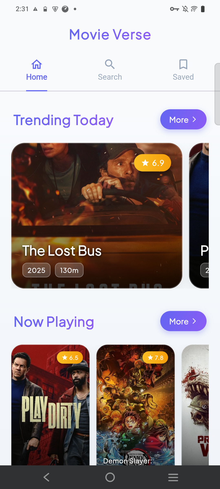
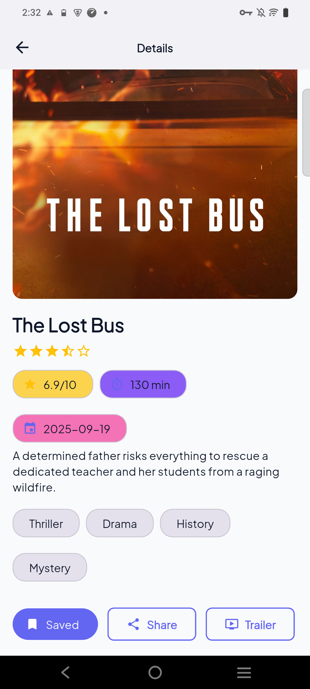
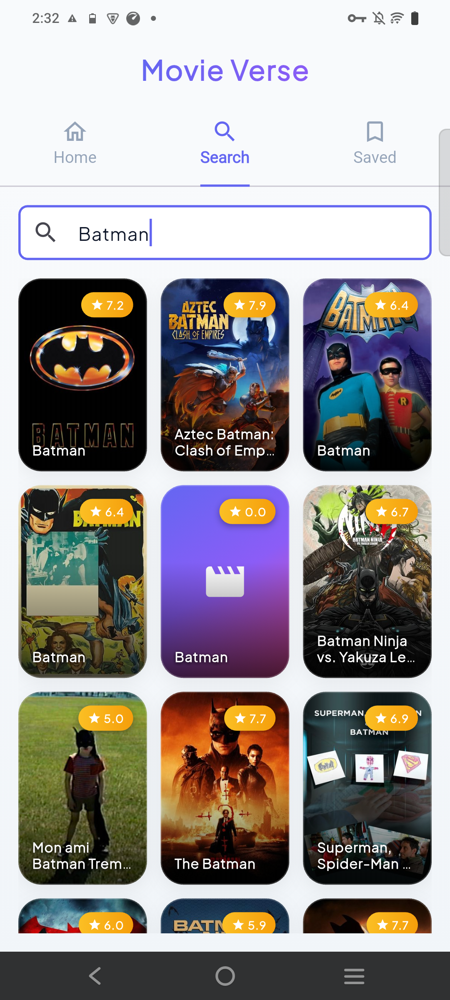
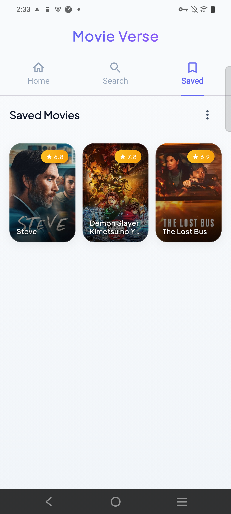

# 🎬 Movie Verse

A modern Flutter application for discovering, exploring, and saving movies using The Movie Database (TMDB) API. Built with clean architecture principles and offline-first approach.


## 📱 Screenshots

<div align="center">
  
  
  
  
</div>

## ✨ Features

### 🏠 **Home Screen**
- **Trending Movies**: Carousel view of daily trending movies
- **Now Playing**: Horizontal list of currently playing movies
- **Pull-to-Refresh**: Refresh content with swipe gesture
- **Infinite Scroll**: Load more movies as you scroll
- **Hero Animations**: Smooth transitions between screens

### 🔍 **Search & Discovery**
- **Real-time Search**: Debounced search with instant results
- **Smart Search**: Network calls only after user stops typing (500ms delay)
- **Multiple Views**: Toggle between grid and list layouts
- **Search History**: Persistent search results

### 💾 **Movie Details**
- **Comprehensive Info**: Title, rating, overview, genres, runtime
- **High-Quality Images**: Full-resolution movie posters
- **Bookmark System**: Save movies for later viewing
- **Share Functionality**: Share movies with deep links
- **Trailer Integration**: Quick access to YouTube trailers

### 📚 **Saved Movies**
- **Personal Collection**: View all bookmarked movies
- **Smart Sorting**: Sort by date saved or alphabetically
- **Swipe Actions**: Swipe to delete with undo option
- **Layout Options**: Grid and list view modes
- **Bulk Actions**: Clear all saved movies

### 🌐 **Offline-First Architecture**
- **Local Database**: SQLite with Drift ORM
- **Offline Support**: App works without internet connection
- **Smart Caching**: API responses cached locally
- **Real-time Updates**: Stream-based data synchronization

### 🔗 **Deep Linking**
- **Share Movies**: Custom deep links (`visionmovies://movie/{id}`)
- **Cold Start Support**: Handle links when app is closed
- **Foreground Handling**: Process links while app is running
- **Automatic Navigation**: Direct navigation to movie details

## 🏗️ Architecture

This project follows **Clean Architecture** principles with clear separation of concerns:

```
lib/
├── 📁 domain/           # Business logic & entities
│   ├── entities/        # Domain models
│   └── repositories/     # Repository interfaces
├── 📁 data/             # Data layer
│   ├── repositories/    # Repository implementations
│   └── router/          # App routing configuration
├── 📁 ui/               # Presentation layer
│   ├── details/         # Movie details screens
│   ├── home/           # Home screen components
│   ├── saved/          # Saved movies screens
│   ├── search/         # Search functionality
│   ├── splash/         # Splash screen
│   └── widgets/        # Reusable UI components
└── 📁 core/            # Shared utilities
    ├── constants/      # App constants & themes
    ├── db/             # Database layer
    ├── deep_link/      # Deep link handling
    ├── di/             # Dependency injection
    ├── network/        # API clients & models
    └── util/           # Utility functions
```

### 🎯 **Key Patterns Used**

- **Repository Pattern**: Data abstraction layer
- **BLoC/Cubit**: State management with Flutter Bloc
- **Dependency Injection**: GetIt + Injectable
- **Offline-First**: Local database with network sync
- **Stream-Based**: Real-time data updates

## 🛠️ Tech Stack

### **Core Technologies**
- **Flutter**: Cross-platform UI framework
- **Dart**: Programming language
- **TMDB API**: Movie database service

### **State Management**
- **flutter_bloc**: BLoC pattern implementation
- **hydrated_bloc**: State persistence

### **Data Layer**
- **Drift**: Type-safe SQLite ORM
- **Retrofit**: Type-safe HTTP client
- **Dio**: HTTP client with interceptors

### **Architecture & DI**
- **GetIt**: Service locator
- **Injectable**: Code generation for DI

### **Navigation & Routing**
- **GoRouter**: Declarative routing
- **app_links**: Deep link handling

### **UI & UX**
- **Material Design 3**: Modern UI components
- **Cached Network Image**: Image caching
- **Shimmer**: Loading animations
- **Google Fonts**: Typography

### **Development Tools**
- **build_runner**: Code generation
- **mockito**: Testing mocks
- **bloc_test**: BLoC testing utilities

## 🚀 Getting Started

### **Prerequisites**
- Flutter SDK (3.7.2 or higher)
- Dart SDK
- Android Studio / VS Code
- TMDB API Key

### **Installation**

1. **Clone the repository**
   ```bash
   git clone https://github.com/yourusername/movie_verse.git
   cd movie_verse
   ```

2. **Install dependencies**
   ```bash
   flutter pub get
   ```

3. **Configure API Key**
   
   **Option 1: Environment Variable (Recommended)**
   ```bash
   flutter run --dart-define=TMDB_API_KEY=your_api_key_here
   ```
   
   **Option 2: Direct Configuration**
   Edit `lib/core/env/app_config.dart`:
   ```dart
   static const tmdbApiKey = "your_api_key_here";
   ```

4. **Generate code**
   ```bash
   flutter packages pub run build_runner build
   ```

5. **Run the app**
   ```bash
   flutter run
   ```

### **Getting TMDB API Key**

1. Visit [TMDB API](https://www.themoviedb.org/settings/api)
2. Create an account and request an API key
3. Use the API key in your configuration

## 📱 Platform Support

- ✅ **Android** (API 21+)
- ✅ **iOS** (iOS 11.0+)
- ✅ **Web** (Basic support)

## 🧪 Testing

### **Run Tests**
```bash
# Unit tests
flutter test

# Integration tests
flutter test integration_test/

# Coverage report
flutter test --coverage
```

### **Test Structure**
```
test/
├── core/              # Core functionality tests
├── data/              # Repository tests
├── presentation/      # BLoC/Cubit tests
└── helper/            # Test utilities & mocks
```

## 📦 Build & Deployment

### **Android APK**
```bash
flutter build apk --release
```

### **iOS App**
```bash
flutter build ios --release
```

### **Web**
```bash
flutter build web
```

## 🔧 Configuration

### **Environment Variables**
- `TMDB_API_KEY`: Your TMDB API key
- `BASE_URL`: TMDB API base URL (default: https://api.themoviedb.org/3/)

### **Deep Link Configuration**

**Android** (`android/app/src/main/AndroidManifest.xml`):
```xml
<intent-filter android:autoVerify="true">
    <action android:name="android.intent.action.VIEW" />
    <category android:name="android.intent.category.DEFAULT" />
    <category android:name="android.intent.category.BROWSABLE" />
    <data android:scheme="visionmovies" />
</intent-filter>
```

**iOS** (`ios/Runner/Info.plist`):
```xml
<key>CFBundleURLTypes</key>
<array>
    <dict>
        <key>CFBundleURLName</key>
        <string>visionmovies</string>
        <key>CFBundleURLSchemes</key>
        <array>
            <string>visionmovies</string>
        </array>
    </dict>
</array>
```

## 🤝 Contributing

We welcome contributions! Please follow these steps:

1. **Fork the repository**
2. **Create a feature branch**
   ```bash
   git checkout -b feature/amazing-feature
   ```
3. **Commit your changes**
   ```bash
   git commit -m 'Add amazing feature'
   ```
4. **Push to the branch**
   ```bash
   git push origin feature/amazing-feature
   ```
5. **Open a Pull Request**

### **Contribution Guidelines**
- Follow Dart/Flutter style guidelines
- Write tests for new features
- Update documentation
- Ensure all tests pass

## 📄 License

This project is licensed under the MIT License - see the [LICENSE](LICENSE) file for details.

## 🙏 Acknowledgments

- [The Movie Database (TMDB)](https://www.themoviedb.org/) for providing the API
- [Flutter Team](https://flutter.dev/) for the amazing framework
- [Material Design](https://material.io/) for design guidelines
- All open-source contributors

## 📞 Support

If you encounter any issues or have questions:

- 📧 **Email**: your.email@example.com
- 🐛 **Issues**: [GitHub Issues](https://github.com/yourusername/movie_verse/issues)
- 💬 **Discussions**: [GitHub Discussions](https://github.com/yourusername/movie_verse/discussions)

## 🗺️ Roadmap

### **Upcoming Features**
- [ ] User authentication
- [ ] Movie recommendations
- [ ] Watchlist management
- [ ] Social features
- [ ] Push notifications
- [ ] Dark mode improvements
- [ ] Accessibility enhancements

### **Known Issues**
- [ ] Image loading optimization needed
- [ ] Error handling improvements
- [ ] Performance optimizations

---

<div align="center">
  <p>Made with ❤️ using Flutter</p>
  <p>⭐ Star this repository if you found it helpful!</p>
</div>